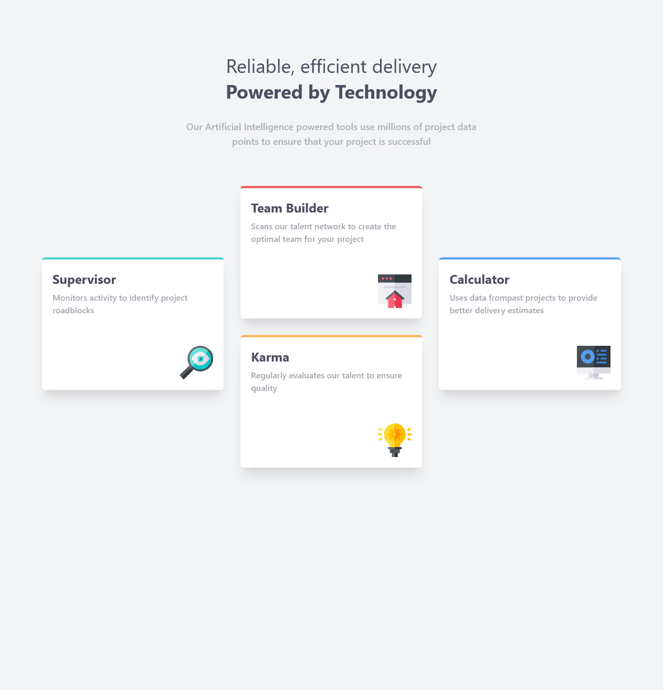

# Frontend Mentor - Four card feature section solution

This is a solution to the [Four card feature section challenge on Frontend Mentor](https://www.frontendmentor.io/challenges/four-card-feature-section-weK1eFYK).  

## Table of contents

- [Overview](#overview)
  - [The challenge](#the-challenge)
  - [Screenshot](#screenshot)
  - [Links](#links)
- [My process](#my-process)
  - [Built with](#built-with)
  - [What I learned](#what-i-learned)
  - [Continued development](#continued-development)
  - [Useful resources](#useful-resources)
- [Author](#author)
- [Acknowledgments](#acknowledgments)

## Overview

### The challenge

Users should be able to:

- View the optimal layout for the site depending on their device's screen size

### Screenshot



### Links

- Solution URL: [@FrontendMentor.io](https://www.frontendmentor.io/solutions/four-card-feature-section-with-tailwindcss-and-vitejs-Erybcg2SL)
- Live Site URL: [@Vercel.app](https://prj-09-four-card-feature-section.vercel.app/)

## My process

### Built with

- Semantic HTML5 markup
- CSS custom properties
- Flexbox
- CSS Grid
- Mobile-first workflow
- [TailwindCSS](https://tailwindcss.com/) - TailwindCSS Framework
- [Vite.js](https://vitejs.dev/) - Next Generation Frontend Tooling

### What I learned

Use this section to recap over some of your major learnings while working through this project. Writing these out and providing code samples of areas you want to highlight is a great way to reinforce your own knowledge.

How to connect tailwind to html:
```html
  <body>
    <main-container id="app">
    </main-container>
    <script type="module" src="./main.js"></script>
  </body>
```
Using Breakpoint prefix for responsive design:
```html
<div class="bg-white md:col-start-1 md:row-start-1 text-right mx-8 md:mx-4 my-6 md:mt-40 p-5 rounded-md border-t-4 border-prj9Cyan shadow-xl">
    <p class="text-VeryDarkBlue text-2xl font-bold text-left">Supervisor</p>
    <p class="text-VeryDarkBlue text-sm md:text-base font-semibold opacity-50 mt-2 my-6 md:h-20 leading-7 text-left">Monitors activity to identify project roadblocks </p>
    
</div>
```

### Continued development

I'll continue using these two frameworks in the upcoming projects.

### Useful resources

- [Vitejs - Getting started](https://vitejs.dev/guide/) - How to setup a vite.js project.
- [TailwindCSS - Installation](https://tailwindcss.com/docs/installation) - How to setup a taiwindcss project.
- [TailwindCSS - responsive design](https://tailwindcss.com/docs/responsive-design) - Using responsive utility variants to build adaptive user interfaces.

## Author

- Website - [Gustavo Sanchez](https://www.gusanche.dev)
- Frontend Mentor - [@gusanchedev](https://www.frontendmentor.io/profile/gusanchedev)
- Github - [@gusanchedev](https://www.github.com/gusanchedev)
- Twitter - [@gusanchedev](https://www.twitter.com/gusanchedev)
- Linkedin - [gusanchedev](https://www.linkedin.com/in/gusanchedev/)

## Acknowledgments

Thanks to Mariapaz for being my friend and support 💙